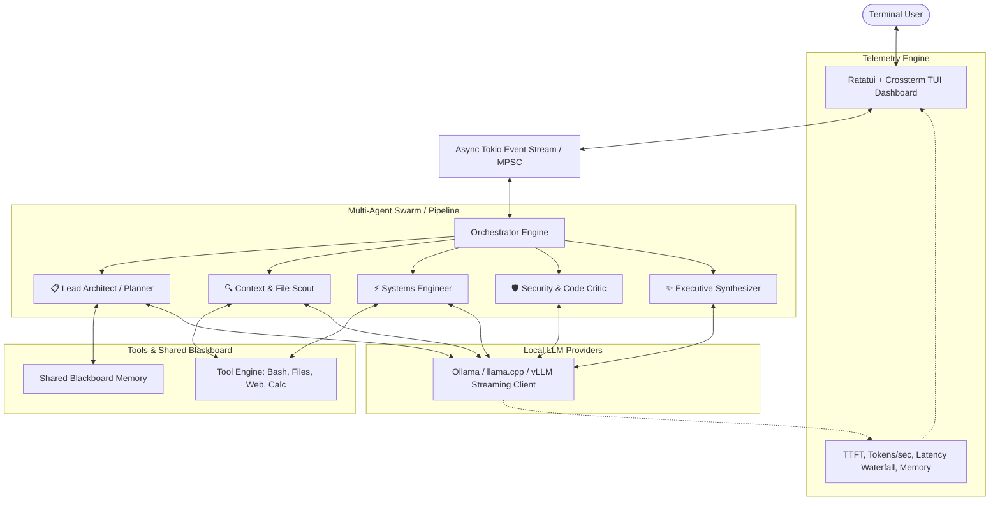

# ⚡ Agent Orchestra (`orchestra-rs`)

> **High-Performance Multi-Agent System Orchestra for Open-Source Models in Terminal UI**  
> Built entirely in Rust for maximum throughput, low latency, and zero UI stutter.

---

## 🚀 Overview

**Agent Orchestra** is an ultra-fast, local-first multi-agent orchestration engine and interactive Terminal User Interface (TUI). It connects directly to local open-source models (via **Ollama**, **llama.cpp**, **vLLM**, or **LM Studio**) to coordinate autonomous, specialized AI agents across configurable swarm topologies with real-time token streaming, dynamic tool execution, and live latency telemetry.

---

## ✨ Features

- **⚡ Blazing Fast Rust Core**: Compiled with Link-Time Optimization (LTO), SIMD optimizations, and full Tokio multi-threading for minimal latency.
- **🖥️ Rich Terminal User Interface (Ratatui + Crossterm)**:
  - **Orchestration Studio**: Visual agent pipeline cards with live spinner animations and a real-time syntax-highlighted multi-agent stream.
  - **Latency & Telemetry Dashboard**: Real-time tokens/second sparklines, Time-To-First-Token (TTFT) metrics, and a step-by-step Gantt waterfall timeline.
  - **Agent Roster & System Prompts**: Deep inspection and live tweaking of agent personas, temperatures, and tool permissions.
  - **Shared Blackboard & System Logs**: Transparent view of inter-agent artifact sharing and system events.
- **🔄 4 Orchestration Topologies**:
  - **Hierarchical Swarm**: Lead Architect decomposes goals, delegates to specialists, and synthesizes deliverables.
  - **Assembly Line (Pipeline)**: Sequential handoffs chaining Architect $\rightarrow$ Scout $\rightarrow$ Engineer $\rightarrow$ Critic $\rightarrow$ Synthesizer.
  - **Peer Review & Debate**: Engineer drafts implementation $\leftrightarrow$ Security Critic audits and refines iteratively.
  - **Direct Engineer**: High-speed single-agent tool execution.
- **🦙 Open-Source Model Support**:
  - **Ollama** (`http://127.0.0.1:11434`): Auto-discovers installed models (`qwen3`, `llama3.1`, `deepseek-r1`, `mistral`, etc.) and handles `<think>`/reasoning tokens.
  - **OpenAI-Compatible Local Endpoints**: llama.cpp `server`, vLLM, LM Studio, LocalAI.
- **🛠️ Built-in Safe Tool Engine**:
  - `bash_command`: Executes terminal commands with timeout safety and output capture.
  - `read_file`: Line-numbered source code inspection.
  - `write_file`: Atomic file writing and directory creation.
  - `web_fetch`: HTTP request extraction for documentation.
  - `calculator`: Fast arithmetic and algebraic formula evaluation.

---

## 🏗️ Architecture



---

## 📦 Installation & Setup

### Prerequisites
- **Rust Toolchain** (1.90+ recommended):
  ```bash
  curl --proto '=https' --tlsv1.2 -sSf https://sh.rustup.rs | sh
  ```
- **Local Model Provider** (e.g. [Ollama](https://ollama.com)):
  ```bash
  ollama run qwen3:4b
  # or llama3.1, deepseek-r1, mistral, etc.
  ```

### Build from Source
```bash
git clone https://github.com/manav363/multi-agent-system.git
cd multi-agent-system

# Build optimized release binary
cargo build --release
```

---

## 🎮 Usage

### 1. Interactive Terminal UI
Launch the interactive dashboard:
```bash
./target/release/orchestra
```

#### TUI Keyboard Shortcuts
| Key | Action |
|---|---|
| `i` or `Enter` | Focus prompt input bar to submit a goal |
| `Esc` | Unfocus input bar / Close modal |
| `Tab` / `1-4` | Switch between Studio, Telemetry, Prompts, and Logs tabs |
| `t` | Open Swarm Topology Selector modal |
| `m` | Open Model Selector modal |
| `j` / `k` / `↑` / `↓` | Scroll workspace transcript |
| `c` | Clear workspace transcript |
| `?` | Open Help and Architecture Guide |
| `q` or `Ctrl+C` | Exit application |

---

### 2. Headless / CLI Benchmark Mode
Execute multi-agent workflows directly from the terminal or scripts:
```bash
# Hierarchical Swarm
./target/release/orchestra --topology hierarchical --model qwen3:4b -p "Architect a high-speed in-memory LRU cache in Rust"

# Peer Review & Debate Loop
./target/release/orchestra --topology debate --model qwen3:4b -p "Implement matrix exponentiation for Fibonacci in O(log N)"

# Custom llama.cpp or vLLM endpoint
./target/release/orchestra --provider llamacpp --endpoint http://127.0.0.1:8080/v1 --model default -p "Explain Raft Consensus"
```

---

## 🧪 Testing

Run the automated test suite:
```bash
cargo test
```

---

## 📄 License

MIT License © 2026 Manav Garg
